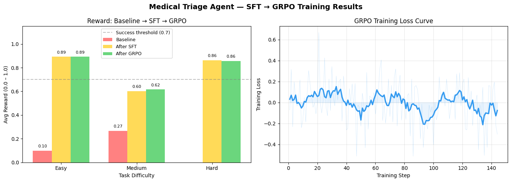

# 🏥 Medical Triage Environment

An OpenEnv-compatible reinforcement learning environment where an AI agent assesses patient symptoms, vitals, and medical history to assign the correct triage urgency level: **emergency**, **urgent**, or **routine**.

**Live Environment:** https://huggingface.co/spaces/dhanvini/medical-triage-env  
**Training Notebook:** https://colab.research.google.com/drive/1ew0HUAFrmF5UXXt_Pzs6rTU2CUJHitkR?usp=sharing  
**Blog Post:** [BLOG.md](./BLOG.md)  
**GitHub:** https://github.com/dhanvini-b/medical-triage-env

---

## Motivation

Medical triage is one of the highest-stakes decisions in healthcare — especially critical in countries like India where doctor availability is limited and emergency rooms are overwhelmed. A wrong triage decision can cost a life: sending an emergency patient home as "routine" is catastrophic; clogging emergency rooms with routine cases delays care for those who need it most.

This environment tests whether a small AI agent can learn to reason clinically under uncertainty — weighing symptoms, vitals, and patient history together to make the right call.

---

## Environment Design

### Tasks

| Task | Difficulty | Description | Success Threshold |
|------|-----------|-------------|-------------------|
| easy | Easy | Classic emergency — chest pain, low BP, low SpO2 in hypertensive smoker | 0.7 |
| medium | Medium | Ambiguous presentation — fever, fatigue, body aches (flu? dengue? typhoid?) | 0.5 |
| hard | Hard | Atypical MI in elderly diabetic — jaw pain and nausea without classic chest pain | 0.7 |

### Observation Space

| Field | Type | Description |
|-------|------|-------------|
| patient_id | string | Unique patient identifier |
| age | integer | Patient age in years |
| symptoms | list[string] | Reported symptoms |
| vitals | dict | heart_rate, bp_systolic, bp_diastolic, spo2, temperature |
| history | list[string] | Relevant medical history |
| step_number | integer | Current step in episode |

### Action Space

| Field | Type | Values |
|-------|------|--------|
| triage_level | string | "emergency", "urgent", "routine" |
| reasoning | string | Agent's clinical explanation |

### Reward Function

The reward function encodes real clinical priorities:

| Condition | Score | Rationale |
|-----------|-------|-----------|
| Correct triage level | +0.7 | Primary objective |
| Emergency → Urgent (under-triage) | -0.2 | Dangerous — patient at risk |
| Emergency → Routine (critical miss) | -0.3 | Catastrophic — patient could die |
| Urgent → Emergency (over-triage) | +0.3 | Acceptable — patient still safe |
| Urgent → Routine | 0.0 | Under-triage, no credit |
| Routine → Urgent | +0.2 | Minor over-triage |
| Reasoning quality | up to +0.2 | Symptoms and history referenced |
| Format compliance | +0.1 | Valid level + reasoning ≥ 10 chars |

**Total reward range: -0.3 to 1.0**

The key design decision: under-triage (missing an emergency) is penalised more harshly than over-triage, reflecting real clinical ethics.

---

## Training Pipeline

### Model
**Qwen/Qwen2.5-0.5B-Instruct** with LoRA (r=16, target: q_proj, v_proj)

### Two-Stage Training: SFT → GRPO

**Stage 1 — Supervised Fine-Tuning (SFT):**  
The base model had no concept of clinical reasoning or output format. SFT teaches it by imitation — 120 correct examples (12 patients × 10 repeats) with expert reasoning. This gives GRPO a meaningful starting point instead of random noise.

**Stage 2 — GRPO (Group Relative Policy Optimisation):**  
With the SFT-warmed model, GRPO refines decisions using reward signal. For each patient, 4 completions are generated and compared — better answers are reinforced, worse ones are penalised. 144 steps, lr=5e-6, temperature=1.2.

### Results



| Task | Baseline | After SFT | After GRPO | Total Change |
|------|----------|-----------|------------|--------------|
| Easy | 0.100 | 0.893 | 0.893 | **+0.793** |
| Medium | 0.267 | 0.603 | 0.617 | **+0.350** |
| Hard | -0.233 | 0.863 | 0.857 | **+1.090** |
| **Average** | **0.045** | **0.786** | **0.789** | **+0.744** |

All three difficulty levels exceed the 0.7 success threshold after training. The hard task — atypical MI in an elderly diabetic — went from a negative baseline (-0.233) to 0.857, demonstrating that the agent learned to identify non-obvious emergency presentations.

**Key insight:** SFT did the heavy lifting (baseline 0.045 → 0.786). GRPO then refined further, particularly on medium cases (+0.014). The two-stage approach was critical — GRPO alone on an untrained model produced near-zero learning signal because all completions got similar rewards.

---

## API Reference

| Endpoint | Method | Description |
|----------|--------|-------------|
| /reset | POST | Start new episode. Body: `{"task": "easy"}` |
| /step | POST | Take action. Body: `{"triage_level": "...", "reasoning": "..."}` |
| /state | GET | Get current environment state |
| /health | GET | Health check |
| /metadata | GET | Environment metadata |
| /schema | GET | Action and observation schemas |

### Quick Start

```bash
# Reset environment
curl -X POST https://dhanvini-medical-triage-env.hf.space/reset \
  -H "Content-Type: application/json" \
  -d '{"task": "easy"}'

# Take action
curl -X POST https://dhanvini-medical-triage-env.hf.space/step \
  -H "Content-Type: application/json" \
  -d '{"triage_level": "emergency", "reasoning": "Chest pain with low BP and SpO2 in hypertensive smoker indicates acute MI."}'
```

---

## Setup

### Local
```bash
pip install -r requirements.txt
uvicorn server:app --host 0.0.0.0 --port 7860
```

### Docker
```bash
docker build -t medical-triage-env .
docker run -p 7860:7860 medical-triage-env
```

---

## Author

**Dhanvini B**  
First Year BTech CSE (AI), Amrita Vishwa Vidyapeetham  
Meta PyTorch OpenEnv Hackathon 2026
